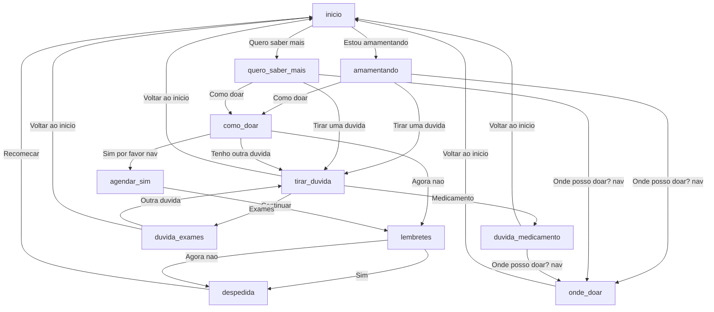

# Lactare Acolhe — Design Spec

**Data:** 2026-09-01
**Versão:** 3 (revisada)
**Contexto:** Projeto Challenge Sprint 3 — Android Kotlin Developer (FIAP)
**Objetivo:** App Android do "Lactare Acolhe": MVP navegável e funcional, com dados mockados, que simula a conexão e o apoio à doação de leite humano. Demonstra arquitetura organizada, navegação com BottomBar e interface de chatbot sem depender de integrações com APIs reais nesta fase.

---

## Requisitos

- 4 telas principais: Onboarding de Apresentação, Home, Chat Interativo e Lista de Pontos de Coleta.
- Navegação com `Navigation Compose` acoplado a um `Scaffold` com `BottomBar`.
- Interface em **Português**, aderente ao tom de voz acolhedor e às cores do manual da marca Lactare — Azul Escuro `#0D3B66` e Azul Claro `#4FB0C6` (ver Pendências).
- Toda a conversa do chat acontece por botões (`OpcaoChat`); não existe campo de texto livre em nenhuma tela do MVP.
- Dados 100% mockados e realistas (sem *Lorem Ipsum*), centralizados em classes e listas estáticas.
- Uso de `Intent` para redirecionamento externo (site e WhatsApp), sempre com tratamento de falha.
- Código simples e explícito, sem frameworks de injeção de dependência (sem Hilt/Koin).
- Toda tela e todo componente reutilizável tem função(ões) `@Preview`, seguindo a divisão Stateful/Stateless descrita adiante.
- Proibição estrita de imagens ou ícones de chupetas e mamadeiras.
- O código deve ser autoexplicativo. Não adicionar comentários.

### Referência de estilo

O repositório [carreiras/to-do-list](https://github.com/carreiras/to-do-list) serve de referência para, especificamente:

- Nomenclatura de arquivos e composables.
- Organização de pacotes por camada.
- Forma de obter o ViewModel no composable via `viewModel()`.

Não é referência de arquitetura de dados nem de identidade visual — nesses pontos vale o que está escrito nesta spec.

---

## Modelos

```kotlin
data class PontoColeta(
    val id: Int,
    val nome: String,
    val endereco: String,
    val bairro: String,
    val zona: String,
    val telefone: String,
    val cep: String
)

data class OpcaoChat(
    val rotulo: String,
    val proximaMensagem: String,
    val rota: String? = null
)

data class MensagemChat(
    val id: Int,
    val texto: String,
    val isUsuario: Boolean,
    val opcoes: List<OpcaoChat> = emptyList()
)
```

**Sobre `PontoColeta`:** `bairro` e `zona` são campos separados de propósito. `bairro` é exibido no card; `zona` é o único campo usado pelo filtro. Misturar os dois níveis num campo só faz o filtro por bairro e o filtro por zona se anularem.

**Sobre `OpcaoChat`:** `proximaMensagem` é a chave lógica no roteiro (`"onde_doar"`), não o texto exibido. Isso permite que o mesmo rótulo ("Quero saber mais") apareça em pontos diferentes da conversa com respostas diferentes, e elimina a dependência de igualdade exata entre o texto do botão e a chave do Map. `rota` preenchido significa que aquela opção, além de continuar a conversa, leva a usuária para outra tela.

---

## Arquitetura

Padrão **MVVM com Mock Repository**:

```text
Compose UI → ViewModel → Repository → Dados Estáticos (MockData)
```

Cada camada se comunica somente com a camada imediatamente adjacente. A UI nunca acessa `MockData` diretamente, nem mesmo para previews — previews recebem dados literais escritos na própria função de preview.

**Trade-off assumido:** sem injeção de dependência, cada ViewModel instancia seu repository como propriedade privada. Isso mantém o código legível e sem configuração extra, ao custo de as ViewModels não serem testáveis de forma isolada (não há como injetar um repository falso). Testes automatizados estão fora do escopo desta sprint, e a decisão foi tomada com isso em vista.

---

## Estrutura de Pacotes

```text
br.com.fiap.lactareacolhe/
├── model/
│   ├── PontoColeta.kt
│   ├── OpcaoChat.kt
│   └── MensagemChat.kt
├── data/
│   ├── MockData.kt
│   └── Constants.kt
├── repository/
│   └── LactareRepository.kt
├── viewmodel/
│   ├── ChatViewModel.kt
│   └── PontosColetaViewModel.kt
├── ui/
│   ├── theme/
│   │   ├── Color.kt
│   │   ├── Type.kt
│   │   └── Theme.kt
│   ├── screens/
│   │   ├── ApresentacaoScreen.kt
│   │   ├── HomeScreen.kt
│   │   ├── ChatScreen.kt
│   │   └── PontosColetaScreen.kt
│   └── components/
│       ├── BalaoMensagemChat.kt
│       ├── ChipFiltroRegiao.kt
│       └── CardPontoColeta.kt
├── navigation/
│   ├── AppNavigation.kt
│   └── Rotas.kt
└── MainActivity.kt
```

---

## Camada de Dados

### MockData.kt

`object MockData`, singleton.

**`val pontosDeColeta: List<PontoColeta>`** — lista pré-preenchida com hospitais e postos de coleta reais da cidade de São Paulo. Origem dos dados: rBLH/Fiocruz (ver Pendências).

**`val roteiroChat: Map<String, MensagemChat>`** — a chave é o identificador lógico do nó da conversa. O roteiro completo, com todas as chaves e transições, está detalhado na seção "Roteiro do Chat" logo abaixo.

**`const val CHAVE_MENSAGEM_INICIAL = "inicio"`** — o nó `"inicio"` é a mensagem de boas-vindas do bot, carregada assim que a tela de chat abre. Sem ela, a usuária entra numa tela vazia e sem nada para clicar.

**`const val CHAVE_FALLBACK = "fallback"`** — nó usado quando uma chave não existe no roteiro. Como toda entrada da usuária vem de um botão (nunca de texto livre), esse nó nunca deveria ser alcançado em uso normal — ele existe como rede de segurança para o caso de um `OpcaoChat.proximaMensagem` apontar, por erro no código, para uma chave que não existe no Map.

**`val passosOnboarding: List<PassoOnboarding>`** — conteúdo das 3 páginas do onboarding (ver a seção ApresentacaoScreen).

### Roteiro do Chat

Adaptação do fluxo mostrado no PDF de referência para um formato 100% por botões. Os dois pontos que no PDF pediam texto livre foram resolvidos assim:

- **Nome da usuária** → removido. A mensagem inicial já parte direto para as opções, sem perguntar ou usar o nome depois.
- **CEP para localizar o ponto de coleta** → removido. A opção "Onde posso doar?" navega direto para `Rotas.PONTOS_COLETA`, onde a usuária vê a lista completa filtrável por zona — não precisa digitar nada.



`nav` marca as opções com `rota = Rotas.PONTOS_COLETA` preenchido — além de continuar o roteiro, elas navegam a usuária para a tela de Pontos de Coleta.

| Chave | Opções (rótulo → próxima chave) |
| --- | --- |
| `inicio` | Estou amamentando → `amamentando` · Quero saber mais → `quero_saber_mais` |
| `amamentando` | Como doar → `como_doar` · Onde posso doar? (nav) → `onde_doar` · Tirar uma dúvida → `tirar_duvida` |
| `quero_saber_mais` | mesmas três opções de `amamentando` |
| `como_doar` | Sim, por favor! (nav) → `agendar_sim` · Agora não → `lembretes` · Tenho outra dúvida → `tirar_duvida` |
| `onde_doar` | Voltar ao início → `inicio` |
| `agendar_sim` | Continuar → `lembretes` |
| `tirar_duvida` | Exames → `duvida_exames` · Medicamento → `duvida_medicamento` · Voltar ao início → `inicio` |
| `duvida_exames` | Tenho outra dúvida → `tirar_duvida` · Voltar ao início → `inicio` |
| `duvida_medicamento` | Onde posso doar? (nav) → `onde_doar` · Voltar ao início → `inicio` |
| `lembretes` | Sim, com certeza! → `despedida` · Agora não, obrigada → `despedida` |
| `despedida` | Recomeçar → `inicio` |
| `fallback` | Recomeçar → `inicio` |

Conteúdo completo, com os textos reais e os objetos `MensagemChat`/`OpcaoChat` prontos para colar em `MockData.kt`, está no arquivo `RoteiroChat_MockData.kt`.

### Constants.kt

`object Constants` — centraliza os valores usados nas Intents, evitando strings espalhadas pela UI.

- `const val SITE_URL: String` — URL da página do "Agosto Dourado".
- `const val WHATSAPP_NUMERO: String` — apenas dígitos, no formato DDI + DDD + número, sem `+`, espaços, parênteses ou traços. Exemplo de forma: `5511999999999`.
- `const val FILTRO_TODOS = "Todos"` — rótulo do chip que desativa o filtro. É referenciado pela ViewModel e pela UI, então não pode ser string literal repetida.

---

## Repository

### LactareRepository.kt

Classe que concentra o acesso ao `MockData`.

- `fun getPontosColeta(): List<PontoColeta>` — retorna a lista completa.
- `fun getZonas(): List<String>` — retorna `FILTRO_TODOS` seguido das zonas distintas presentes em `pontosDeColeta`, em ordem alfabética. Os chips da tela derivam daqui; não há lista de chips escrita à mão em lugar nenhum.
- `fun getMensagemInicial(): MensagemChat` — retorna o nó `"inicio"`.
- `fun getRespostaBot(chave: String): MensagemChat` — busca direta em `roteiroChat`; retorna o nó `"fallback"` se a chave não existir.

Camada intencionalmente fina, para isolar a UI da origem dos dados: quando o mock for substituído por uma API real, só esta classe muda.

---

## ViewModel

Toda a lógica vive na ViewModel. As telas são apenas apresentação.

Sem framework de injeção, cada ViewModel instancia o repository diretamente: `private val repository = LactareRepository()`.

### ChatViewModel.kt

Estende `ViewModel()`.

- `historico: StateFlow<List<MensagemChat>>` — conversa exibida na tela. Inicializado com `repository.getMensagemInicial()` no bloco `init`, nunca vazio.
- `isDigitando: StateFlow<Boolean>` — verdadeiro enquanto o bot "digita". Serve para dois fins: exibir o indicador de digitação e impedir novos envios durante a espera.
- `fun selecionarOpcao(opcao: OpcaoChat)`:
  1. Ignora a chamada se `isDigitando` for verdadeiro.
  2. Adiciona ao histórico a fala da usuária com `opcao.rotulo`.
  3. Marca `isDigitando = true`, aguarda um `delay` curto em `viewModelScope`, adiciona `repository.getRespostaBot(opcao.proximaMensagem)` e marca `isDigitando = false`.

**Geração de ids:** as mensagens vindas do `MockData` têm id fixo, e a mesma opção pode ser escolhida mais de uma vez na conversa. Inserir esses objetos diretamente produz ids duplicados no histórico, o que quebra o `key` do `LazyColumn`. A ViewModel mantém um contador próprio e copia cada mensagem com um id novo antes de adicioná-la à lista.

### PontosColetaViewModel.kt

Estende `ViewModel()`.

- `pontosFiltrados: StateFlow<List<PontoColeta>>` — lista atualmente visível.
- `zonas: List<String>` — chips disponíveis, vindos de `repository.getZonas()`.
- `filtroSelecionado: StateFlow<String>` — inicia em `Constants.FILTRO_TODOS`. Existe para a UI conseguir destacar o chip ativo.
- `fun filtrarPorZona(zona: String)` — atualiza `filtroSelecionado` e recalcula `pontosFiltrados`. Se `zona == FILTRO_TODOS`, devolve a lista completa; caso contrário filtra por `it.zona == zona`.

---

## Navegação

### Rotas.kt

```kotlin
object Rotas {
    const val APRESENTACAO = "apresentacao"
    const val HOME = "home"
    const val CHAT = "chat"
    const val PONTOS_COLETA = "pontos_coleta"
}
```

### AppNavigation.kt

- `rememberNavController()` para controle de fluxo.
- `NavHost(startDestination = Rotas.APRESENTACAO)`.
- `Scaffold` cuja `bottomBar` exibe os itens Home, Chat e Locais.
- A `BottomBar` é ocultada condicionalmente na rota `APRESENTACAO`, observando a rota atual via `navController.currentBackStackEntryAsState()`.
- O `PaddingValues` recebido do `Scaffold` **deve** ser aplicado ao `NavHost`. Sem isso o conteúdo rolável passa por baixo da BottomBar — sintoma que só aparece nas listas do Chat e dos Pontos de Coleta.
- Cada ícone da BottomBar tem `contentDescription` preenchido.

**Navegação entre abas** — todo item da BottomBar navega com:

```kotlin
navController.navigate(rota) {
    popUpTo(navController.graph.findStartDestination().id) { saveState = true }
    launchSingleTop = true
    restoreState = true
}
```

Sem essas três flags, cada toque numa aba empilha um destino novo e o botão voltar percorre todo o histórico de toques em vez de sair do app.

**Escopo do ChatViewModel:** obtido com `viewModel()` dentro do composable da rota, ficando atrelado ao `NavBackStackEntry` daquele destino. Combinado com `saveState`/`restoreState`, a conversa é preservada ao alternar entre abas. Esse é o comportamento desejado: sair para ver os pontos de coleta e voltar ao chat não deve zerar o que já foi conversado.

---

## Convenção de Preview

`@Preview` não instancia ViewModels reais sem complexidade desnecessária. Por isso toda tela que depende de ViewModel é dividida em duas funções `@Composable` no mesmo arquivo:

- **Versão stateful** (`XScreen`) — recebe `viewModel` e `navController`, coleta os `StateFlow` e delega para a content. É a única chamada pela navegação. **Sem `@Preview`**.
- **Versão content** (`XContent`) — recebe apenas dados simples (`List`, `String`, `Boolean`) e lambdas. É a que leva as `@Preview`.

Componentes reutilizáveis sem dependência de ViewModel (`BalaoMensagemChat`, `CardPontoColeta`, `ChipFiltroRegiao`) já são previewáveis diretamente.

Padrão de anotação:

```kotlin
@Preview(showBackground = true, name = "Nome descritivo do estado")
@Composable
private fun NomeContentPreview() {
    NomeContent(/* dados de exemplo */)
}
```

Cada content tem no mínimo uma preview do estado normal. Telas com estados alternativos previstos nesta spec (lista vazia, bot digitando) levam uma preview por estado.

---

## Telas

### ApresentacaoScreen (Onboarding)

- **Não exibe a BottomBar.**
- `ApresentacaoScreen` (stateful): recebe o `navController`.
- `ApresentacaoContent` (previewável): recebe `passos: List<PassoOnboarding>` e callback `onFinalizar`.
- `HorizontalPager` com 3 passos, indicador de página abaixo do conteúdo e botão "Pular" no topo, que dispara o mesmo `onFinalizar`.
- O botão "Começar" aparece apenas na última página.
- `onFinalizar` executa `navController.navigate(Rotas.HOME) { popUpTo(Rotas.APRESENTACAO) { inclusive = true } }`, removendo o onboarding do backstack.

**Conteúdo dos passos** (em `MockData.passosOnboarding`):

| # | Título | Texto |
| --- | --- | --- |
| 1 | Bem-vinda ao Lactare Acolhe | Um espaço para tirar dúvidas sobre amamentação e doação de leite humano, no seu tempo e sem julgamento. |
| 2 | Sua dúvida tem resposta | Converse com a gente sobre pega, produção de leite, armazenamento e o que mais precisar saber. |
| 3 | Doar é mais simples do que parece | Encontre o banco de leite ou posto de coleta mais perto de você e descubra como dar o primeiro passo. |

```kotlin
data class PassoOnboarding(val titulo: String, val texto: String)
```

### HomeScreen

- `HomeScreen` (stateful): recebe o `navController` e obtém o contexto com `LocalContext.current` — não o recebe por parâmetro. Monta os callbacks de Intent aqui e passa apenas lambdas para a content.
- `HomeContent` (previewável): recebe `onAbrirNoticia`, `onAbrirWhatsApp`, `onAbrirChat`.
- Banner (Card) "Agosto Dourado": ao clicar, dispara `Intent(Intent.ACTION_VIEW, Uri.parse(Constants.SITE_URL))`.
- Call to action ("Gostaria de conhecer..."): botão do WhatsApp, que abre `https://wa.me/${Constants.WHATSAPP_NUMERO}`, e botão para o chat interno, que navega para `Rotas.CHAT`.

**Tratamento de falha nas Intents:** as duas chamadas são envolvidas em `try/catch (ActivityNotFoundException)`, exibindo uma mensagem curta ao usuário no `catch`. O cenário mais provável é o emulador sem WhatsApp instalado — que é exatamente o ambiente da avaliação.

### ChatScreen

- `ChatScreen` (stateful): coleta `historico` e `isDigitando` do `ChatViewModel` via `collectAsStateWithLifecycle()`. Ao receber uma `OpcaoChat` com `rota != null`, chama `viewModel.selecionarOpcao(opcao)` **e** `navController.navigate(rota)`.
- `ChatContent` (previewável): recebe `historico: List<MensagemChat>`, `isDigitando: Boolean` e callback `onOpcaoSelecionada: (OpcaoChat) -> Unit`. Não existe nenhum `TextField` ou campo de entrada de texto nesta tela — a única forma de interação da usuária é tocar num dos botões de opção.
- `LazyColumn` com `key = { it.id }`, rolando automaticamente para a última mensagem a cada item novo.
- Mensagens alinhadas à direita (usuária) ou à esquerda (bot).
- As opções são renderizadas como botões abaixo da bolha **apenas na última mensagem do bot**. Mensagens anteriores exibem só o texto, evitando que a usuária reabra um ramo já respondido no meio da conversa.
- Enquanto `isDigitando` for verdadeiro, exibe um indicador de digitação no lugar das opções.
- A opção "Onde posso doar?" tem `rota = Rotas.PONTOS_COLETA` no `MockData`. A tela não precisa conhecer esse rótulo — o comportamento vem do dado.

### PontosColetaScreen

- `PontosColetaScreen` (stateful): coleta `pontosFiltrados` e `filtroSelecionado`.
- `PontosColetaContent` (previewável): recebe `pontos: List<PontoColeta>`, `zonas: List<String>`, `filtroSelecionado: String` e callback `onFiltroSelecionado(String)`.
- Topo: `LazyRow` de chips, um por item de `zonas`. O chip cujo rótulo é igual a `filtroSelecionado` é renderizado no estado ativo.
- Corpo: `LazyColumn` com um `CardPontoColeta` por item, exibindo nome, endereço, bairro, CEP e telefone.
- **Estado vazio:** se `pontos` estiver vazia, no lugar da lista aparece uma mensagem curta ("Nenhum ponto de coleta nesta região"). Improvável com dados mockados, mas a tela não pode ficar em branco sem explicação.

---

## Identidade Visual

Cores em `Color.kt`:

| Token | Valor | Uso |
| --- | --- | --- |
| Azul Escuro | `#0D3B66` | Superfícies com texto branco: topo, BottomBar, botões primários |
| Azul Claro | `#4FB0C6` | Destaques, chips ativos, fundos de apoio |

**Regra de contraste:** `#4FB0C6` com texto branco fica em torno de 2.2:1, abaixo do mínimo de 4.5:1 da WCAG AA. Texto sobre azul claro usa o azul escuro. Texto branco só sobre `#0D3B66`.

Tipografia em `Type.kt`, seguindo o manual da marca (ver Pendências).

---

## Dependências a Adicionar

| Dependência | Motivo |
| --- | --- |
| `navigation-compose` | NavHost, NavController e suporte a rotas |
| `material3` | Componentes de UI (Scaffold, NavigationBar, Cards, FilterChip) |
| `material-icons-extended` | Ícones de Chat e Map para a BottomBar, ausentes no pacote core; mantida por simplicidade apesar do custo de tamanho no APK |
| `lifecycle-viewmodel-compose` | Chamada segura de `viewModel()` em Composables |
| `lifecycle-runtime-compose` | Suporte a `collectAsStateWithLifecycle()` |

---

## Pendências

Itens bloqueantes ou com valor provisório, a resolver antes da entrega:

| Item | Situação | O que falta |
| --- | --- | --- |
| `Constants.SITE_URL` | Placeholder | URL real da página do Agosto Dourado. Link quebrado durante a demonstração chama mais atenção que qualquer acerto de arquitetura. |
| `Constants.WHATSAPP_NUMERO` | Placeholder | Número oficial do projeto, só dígitos. |
| Cores `#0D3B66` / `#4FB0C6` | Provisórias | Confirmação no manual oficial da marca Lactare. |
| Tipografia | Indefinida | Fonte do manual da marca, ou decisão explícita de usar a tipografia padrão do Material 3. |
| Dados de `pontosDeColeta` | Resolvido, com ressalva | O arquivo `PontosColetaSP_MockData.kt` foi gerado a partir da rBLH/Fiocruz, mas usa o contrato antigo de `PontoColeta` (campo único `regiao`). Precisa ser reexportado para o contrato atual, com `bairro` e `zona` como campos separados. |
| Lembretes semanais | Só roteiro | A opção "Sim, com certeza!" apenas avança a conversa no `roteiroChat`; não há agendamento nem notificação real implementados nesta sprint. |

---

## Conceitos Demonstrados (Avaliação Sprint 3)

- **Organização arquitetural:** separação estrita entre UI, ViewModel e dados, com a camada de repository isolando a origem do mock.
- **Navigation Compose:** rotas integradas a um `Scaffold` com barra inferior, exibição condicional da BottomBar e manipulação de backstack (`popUpTo`, `saveState`, `restoreState`, `launchSingleTop`).
- **Gestão de estado reativa:** `StateFlow` para histórico de conversa, indicador de digitação e filtros, com atualização instantânea da UI.
- **Componentização e previews:** componentes *stateless* isolados, com preview por estado relevante.
- **Interação nativa:** Intents para browser e WhatsApp, com tratamento de aplicativo ausente.
- **Acessibilidade:** `contentDescription` nos ícones e contraste de texto verificado contra WCAG AA.
