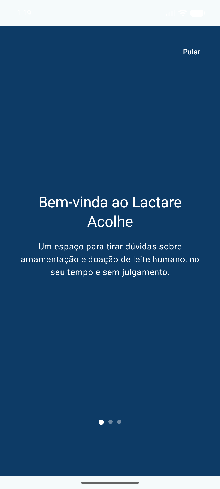
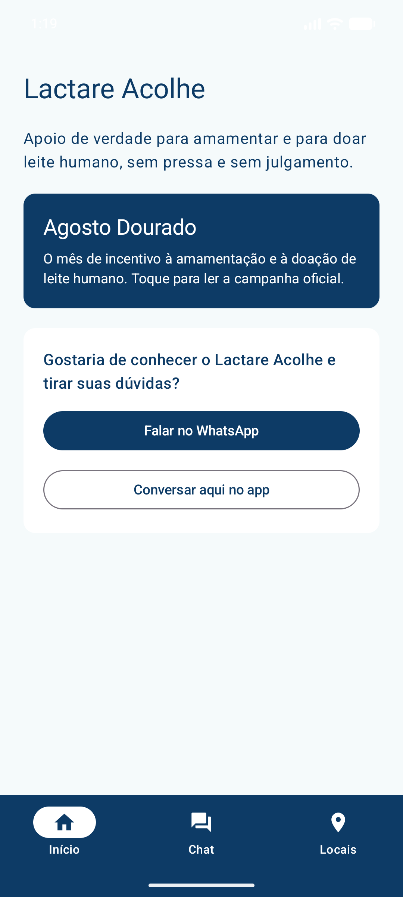
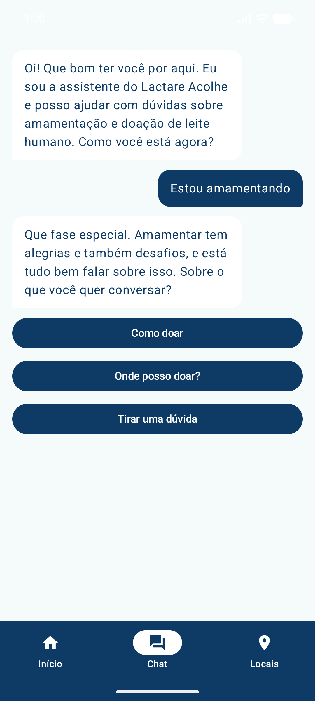
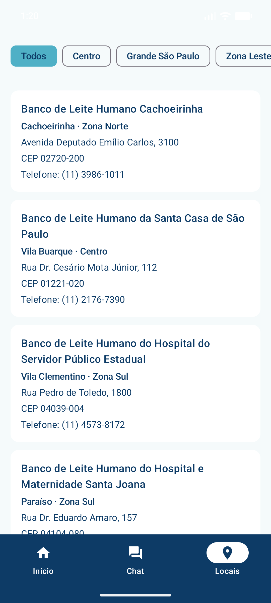
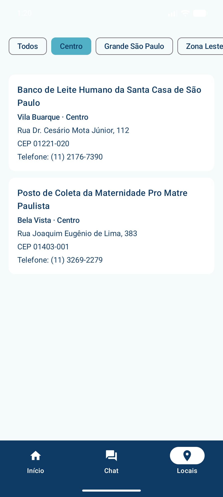

# Lactare Acolhe

App Android (Jetpack Compose) desenvolvido para o **Challenge Sprint 3 — Android Kotlin Developer (FIAP)**.
MVP navegável, com dados 100% mockados, que simula a conexão e o apoio à amamentação e à doação de leite humano.

## Equipe

**Nome da equipe:** P2A

| Caio Vinicius Magalhães Leria | 557833 |

| César Brasil Alves | 556236 |

| Lucas Moura Machado | RM: 557431  |

| Pedro Salimon Nascimento | RM: 555038  |

## Repositório

🔗 [github.com/CaioLeria/ProjetoLactareAcolhe](https://github.com/CaioLeria/ProjetoLactareAcolhe)

## Objetivo do aplicativo

O Lactare Acolhe nasceu do problema apresentado no pitch: mães que amamentam e querem doar leite humano
frequentemente não sabem por onde começar, têm dúvidas simples (exames, medicação, armazenamento) e não
encontram, num só lugar, informação acolhedora e o caminho até um banco de leite perto delas.

O app propõe três frentes que resolvem isso sem depender de nenhuma integração externa nesta Sprint:

1. **Acolher** — uma apresentação inicial que explica o propósito do app antes de qualquer pedido de dado ou cadastro.
2. **Tirar dúvidas sem julgamento** — um chat guiado por botões (sem depender de digitação livre) que conduz a
   conversa sobre amamentação e doação, com respostas coerentes com o tom de voz da marca.
3. **Encontrar onde doar** — uma lista real de bancos de leite e postos de coleta da cidade de São Paulo,
   filtrável por região, para transformar a vontade de doar em uma ação concreta.

## Escopo funcional implementado

| Requisito funcional | O que foi implementado | Por que entrou nesta Sprint |
| --- | --- | --- |
| Onboarding de apresentação | Tela com 3 passos (swipe), botão "Pular" e "Começar" | É o primeiro contato da usuária com o app — precisa passar acolhimento antes de qualquer funcionalidade |
| Chat guiado por opções | Fluxo de conversa ramificado (`MockData.roteiroChat`), com indicador de "digitando..." e histórico rolável | Resolve a dor central do pitch: tirar dúvidas sem parecer um formulário ou um FAQ frio |
| Lista de pontos de coleta com filtro por região | Lista de 29 bancos de leite/postos de coleta reais de SP, com chips de filtro por zona | É o destino prático do chat — sem ele, a conversa não vira ação |
| Navegação entre chat e lista | Opções do chat que levam direto para "Locais" (ex.: "Onde posso doar?") | Mostra o fluxo de uso ponta a ponta, não telas soltas |
| Atalhos externos (WhatsApp / site da campanha) | Botões na Home com `Intent` e tratamento de app ausente | Reconhece que parte do público prefere continuar a conversa em um canal já conhecido |

Ficaram **fora do escopo desta Sprint** (por não serem exigidos e para manter o MVP simples): cadastro/login de
usuária, campo de texto livre no chat, integração real com WhatsApp Business ou com uma API de bancos de leite,
e persistência dos dados (tudo é mockado em memória, reiniciando a cada abertura do app).

## Telas do aplicativo

Prints tirados do app rodando em emulador Android (API 35), a partir do build de debug gerado pelo próprio projeto.

### 1. Apresentação (Onboarding)



Três passos explicando a proposta do app antes de qualquer outra tela. Possui indicador de página, botão
"Pular" e botão "Começar" na última página — ambos levam para a Home.

### 2. Home



Tela inicial com o card da campanha "Agosto Dourado" (abre o site oficial) e dois atalhos para tirar dúvidas:
falar por WhatsApp ou conversar no chat do próprio app. Contém a barra de navegação inferior (Início / Chat / Locais).

### 3. Chat



Conversa guiada inteiramente por botões (`OpcaoChat`), sem campo de texto livre. Cada resposta do bot pode
abrir novas opções ou navegar direto para outra tela — no print, a opção "Onde posso doar?" leva para a lista
de pontos de coleta.

### 4. Pontos de Coleta (lista completa)



Lista com os 29 bancos de leite e postos de coleta de São Paulo, cada card mostrando bairro, zona, endereço,
CEP e telefone.

### 5. Pontos de Coleta (filtro por região)



Os chips no topo filtram a lista por zona (Todos, Centro, Zona Norte, Zona Sul, Zona Leste, Zona Oeste,
Grande São Paulo). No print, o filtro "Centro" reduz a lista a 2 resultados.

## Dados mockados

Todos os dados ficam centralizados em `app/src/main/java/br/com/fiap/lactareacolhe/data/MockData.kt`, nunca
espalhados nas telas:

- **`pontosDeColeta`** — lista de 29 bancos de leite/postos de coleta reais da cidade de São Paulo (nome,
  endereço, bairro, zona, telefone, CEP), levantados a partir da Rede Brasileira de Bancos de Leite Humano
  (Fiocruz). Modelados pela classe `PontoColeta`.
- **`roteiroChat`** — um mapa de conversas (`Map<String, MensagemChat>`) que simula um chatbot: cada chave é um
  "estado" da conversa e aponta para a próxima mensagem do bot e suas opções de resposta. Modelado pelas
  classes `MensagemChat` e `OpcaoChat`.
- **`passosOnboarding`** — os 3 textos exibidos na tela de apresentação. Modelado pela classe `PassoOnboarding`.

Nenhuma tela acessa `MockData` diretamente: a leitura passa sempre por `LactareRepository`, que é a única
camada que conhece a origem dos dados — simulando o lugar onde entraria uma chamada de API/Firebase em uma
Sprint futura.

## Funcionalidades implementadas

- Onboarding com múltiplos passos (`HorizontalPager`) e opção de pular.
- Navegação por barra inferior entre Início, Chat e Locais (`Navigation Compose`).
- Chat conversacional guiado por opções, com histórico rolável, animação de scroll automático e indicador de
  "digitando...".
- Passagem de parâmetro/rota entre telas: uma opção do chat pode redirecionar diretamente para a tela de
  Locais.
- Lista de pontos de coleta com filtro dinâmico por região (estado gerenciado em `PontosColetaViewModel` via
  `StateFlow`).
- Abertura de links externos (WhatsApp e site da campanha) com tratamento de erro caso não haja app instalado.
- Estado vazio tratado na lista de pontos de coleta (mensagem quando o filtro não retorna resultados).

## Tecnologias utilizadas

- **Kotlin** 2.1.0
- **Jetpack Compose** (BOM 2025.01.01) + **Material 3**
- **Navigation Compose** 2.8.5
- **Lifecycle ViewModel/Runtime Compose** 2.8.7 (`StateFlow`, `collectAsStateWithLifecycle`)
- **Kotlin Coroutines** (delay simulando o "digitando..." do chat)
- Arquitetura em camadas: `Compose UI → ViewModel → Repository → MockData` (MVVM com repositório mockado)
- **Android Gradle Plugin** 8.8.0, **Gradle** 9.4.1, `compileSdk`/`targetSdk` 35, `minSdk` 24
- Versionamento com **Git/GitHub**

## Como executar o projeto

**Android Studio utilizado:** Android Studio Quail 1 | 2026.1.1 Patch 2
1. Abra o Android Studio → **Open** → selecione a pasta raiz deste projeto.
2. Aguarde o **Gradle sync** (o projeto já vem configurado com AGP 8.8.0, Kotlin 2.1.0, Gradle 9.4.1,
   `compileSdk` 35, `minSdk` 24 — nenhuma configuração manual é necessária).
3. Rode ▶ em um emulador ou dispositivo físico com Android 7.0 (API 24) ou superior.


## Estrutura do projeto

```
app/src/main/java/br/com/fiap/lactareacolhe/
├── model/         PontoColeta, OpcaoChat, MensagemChat, PassoOnboarding
├── data/          MockData (pontos de coleta + roteiro do chat), Constants
├── repository/    LactareRepository
├── viewmodel/     ChatViewModel, PontosColetaViewModel
├── ui/theme/      Color, Type, Theme
├── ui/screens/    Apresentacao, Home, Chat, PontosColeta (stateful + Content)
├── ui/components/ BalaoMensagemChat, ChipFiltroRegiao, CardPontoColeta
├── navigation/    AppNavigation (Scaffold + BottomBar), Rotas
└── MainActivity
```

Arquitetura: `Compose UI → ViewModel → Repository → MockData`. Cada tela é dividida em uma função "stateful"
(conectada ao `NavController`/`ViewModel`) e uma função "Content" sem estado, usada nos `@Preview` — assim toda
tela e todo componente reutilizável tem preview isolado, sem depender de navegação real.

## Pendências (valores provisórios)

Nesta Sprint não há integração com API, Firebase, banco de dados local ou backend — os itens abaixo são
apenas valores de exemplo que devem ser trocados antes de uma eventual publicação real:

| Local | O que trocar |
| --- | --- |
| `data/Constants.kt` → `SITE_URL` | URL oficial da campanha Agosto Dourado |
| `data/Constants.kt` → `WHATSAPP_NUMERO` | Número real do projeto (só dígitos, `55` + DDD + número) |
| `ui/theme/Type.kt` | Tipografia da marca (hoje usa o padrão do Material 3) |
| Textos de `MockData.roteiroChat` | Revisão do tom de voz com a equipe |
